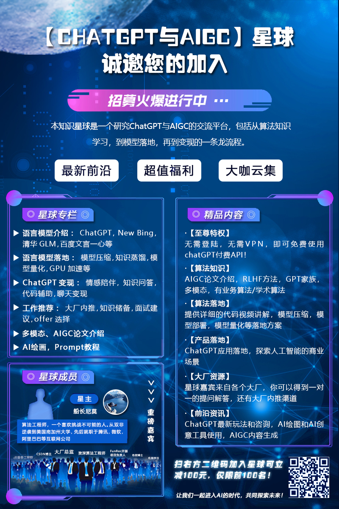

# ChatGPT-AIGC-Lesson

  * 关于ChatGPT，以及AIGC的学习道路，里面包含的内容很多，有语言模型，还有RLHF，多模态论文等等，公众号是 船长尼莫 ，感兴趣可以关注一下~

  * 如何免费体验ChatGPT？[网站地址](https://chatgpt.lizm.xyz/#/chat/1002)
  

## 语言模型介绍
* [大白话介绍语言模型](https://zhuanlan.zhihu.com/p/616900693)

### GPT家族
   * [GPT-1](https://mp.weixin.qq.com/s?__biz=Mzg4NzcxNzM0Mg==&mid=2247484573&idx=1&sn=ee965f45d685a9c0fa22a851214048b0&chksm=cf87682cf8f0e13a7d5cc1ca9a93c58bb31560c365dd36b2738ac1109df9557a07fb747ca9c2&token=533251867&lang=zh_CN#rd)
   * [GPT-2](https://mp.weixin.qq.com/s?__biz=Mzg4NzcxNzM0Mg==&mid=2247484582&idx=1&sn=9f77037a30126225d060a0c34f2183d2&chksm=cf876817f8f0e101b51a07359752d469a5ed97aacab28d06dea2ba0a07924277ae5dc41abb0b&token=533251867&lang=zh_CN#rd)
   * [GPT-3](https://mp.weixin.qq.com/s?__biz=Mzg4NzcxNzM0Mg==&mid=2247484598&idx=1&sn=37f8785df6b54ba85e193940fb86c7c4&chksm=cf876807f8f0e1113e4fdc42c30cc572985b43d676ad7a18fba8ab75ba898286d50101b21376&token=1867297293&lang=zh_CN#rd)
   * [GPT-3.5](https://mp.weixin.qq.com/s?__biz=Mzg4NzcxNzM0Mg==&mid=2247484609&idx=1&sn=9785f559284eb412889f6b7ed57b6d31&chksm=cf876870f8f0e166d4fb0e3b9d87821f02a90cb0289882786f4120c2c09a24f1cbdd2803df28&token=1867297293&lang=zh_CN#rd)
   * [GPT-3.5中的RLHF详细介绍](https://mp.weixin.qq.com/s?__biz=Mzg4NzcxNzM0Mg==&mid=2247484651&idx=1&sn=d4dce9677ecc8cd2f019e9717dab09b6&chksm=cf87685af8f0e14c98418c78b6fd862f32a971e4ec19ea4ba35e4827020aaf39f8cdd1388fea&token=1047332211&lang=zh_CN#rd)

### ChatGPT
   ChatGPT的训练方式，详细介绍，其中视频的介绍要比文字介绍详细的多

   * [视频介绍](https://www.zhihu.com/zvideo/1622015815397568512)

   * [文字介绍](https://mp.weixin.qq.com/s?__biz=Mzg4NzcxNzM0Mg==&mid=2247484249&idx=1&sn=9f553fbc649ae8999bef699157df132f&chksm=cf876fe8f8f0e6fe674b8f990e7cf06f417887138cc60e04e1e85116ddf0294ba2b041e9cf6d&token=533251867&lang=zh_CN#rd)

### 清华GLM
#### ChatGLM部署文档(Colab)
  
  
  

#### GLM-130B 详细论文讲解
   * [文字介绍](https://zhuanlan.zhihu.com/p/617701482)

## Reinforcement LEarning with Human Feedback
### PPO 算法介绍
   * [文字介绍]([https://zhuanlan.zhihu.com/p/617701482](https://zhuanlan.zhihu.com/p/50322028))
   * [代码介绍]([https://zhuanlan.zhihu.com/p/617701482](https://github.com/zhangchuheng123/Reinforcement-Implementation))

## 多模态
   * [CLIP模型文字介绍](https://mp.weixin.qq.com/s?__biz=Mzg4NzcxNzM0Mg==&mid=2247484378&idx=1&sn=ced94475181af0788299d763b0d6cc2c&chksm=cf876f6bf8f0e67dde08e47759e96be8033a3eda272cb0db40b0d2238addfe542ac87a9d7b5c&token=533251867&lang=zh_CN#rd)
   * [CLIP视频代码讲解](https://www.zhihu.com/zvideo/1624349435185618944)
   * [谷歌PaLI](https://mp.weixin.qq.com/s?__biz=Mzg4NzcxNzM0Mg==&mid=2247484663&idx=1&sn=eb022c7e39faf6278c60541206c4124d&chksm=cf876846f8f0e15042218f3d484abaf5b17f091119e4fc2d9a6e52e17514d876828d8a7e9971&token=1047332211&lang=zh_CN#rd)

## 自然语言处理
 * [NLP概览1](https://mp.weixin.qq.com/s?__biz=Mzg4NzcxNzM0Mg==&mid=2247483868&idx=1&sn=239c833bde9fc660ccc506014d70e4bb&chksm=cf876d6df8f0e47b0221c4f1aa415955ba03ff666395926e39e9cd10faec7670a39efe8053a4&token=533251867&lang=zh_CN#rd)
 * [NLP概览2](https://mp.weixin.qq.com/s?__biz=Mzg4NzcxNzM0Mg==&mid=2247483858&idx=1&sn=e0b555e8be0dfbe32f49fd953e4f0788&chksm=cf876d63f8f0e47508feabc5d25d34a091bada3993487334babf5ec005edd225e8bc48001f9b&token=533251867&lang=zh_CN#rd)

### NER命名体识别
 * [SoftLexicon 知识增强型NER](https://mp.weixin.qq.com/s?__biz=Mzg4NzcxNzM0Mg==&mid=2247483994&idx=1&sn=98d16f5e74a0382fb3cbd3729ce05a69&chksm=cf876eebf8f0e7fd6cf647a79a83fb4fa3d33782b54a748349d32cd0eb549600cab7a4b617e2&token=533251867&lang=zh_CN#rd)
 
 * [工业界如何做NER任务？](https://mp.weixin.qq.com/s?__biz=Mzg4NzcxNzM0Mg==&mid=2247483972&idx=1&sn=2f89e6fa1ba97a8724eb7714f1e05814&chksm=cf876ef5f8f0e7e3ecf87b359e6d268529e125d573e7428ac672c2c4ba5705865a67221f78d4&token=533251867&lang=zh_CN#rd)
 
  * [如何利用词库做NER增强](https://mp.weixin.qq.com/s?__biz=Mzg4NzcxNzM0Mg==&mid=2247484213&idx=1&sn=9ba7546fa3d89d96c6658d3bc141b79a&chksm=cf876f84f8f0e6927ae51bbd0a002da67f541cb8527b3614171af8fab1b556424bc6dcc53b1b&token=533251867&lang=zh_CN#rd)
 
 * [Lexicon Enhanced Chinese Sequence Labelling Using BERT Adapter | 达摩院 | ACL 2021](https://mp.weixin.qq.com/s?__biz=Mzg4NzcxNzM0Mg==&mid=2247483962&idx=1&sn=f265c054322504db5a2098d558e7077f&chksm=cf876e8bf8f0e79df17cdda0e83300fa6675705b7863cfe5501c93cc93ca85448ca9ebef6a29&token=533251867&lang=zh_CN#rd)
 
 * [FLAT: Chinese NER Using Flat-Lattice Transformer | 复旦大学| ACL 2020](https://mp.weixin.qq.com/s?__biz=Mzg4NzcxNzM0Mg==&mid=2247484022&idx=1&sn=c6419d27b631bc010ca0223713519683&chksm=cf876ec7f8f0e7d14983ddb425ed75430dfe08b3a3fa22e4e42abc60e956621d6afa6031f9b5&token=533251867&lang=zh_CN#rd)
 
 * [Unsupervised Boundary-Aware Language Model Pretraining for Chinese Sequence Labeling | EMNLP 2022](https://mp.weixin.qq.com/s?__biz=Mzg4NzcxNzM0Mg==&mid=2247484040&idx=1&sn=33a797a940af0ac00e64123438b730ab&chksm=cf876e39f8f0e72fb2920f31f076db9e3865337c9ebfd4427bd101c5748f1a0280b203d3ff6d&token=533251867&lang=zh_CN#rd)
 * [NFLAT : Non-Flat-Lattice Transformer for Chinese Named Entity Recognition](https://mp.weixin.qq.com/s?__biz=Mzg4NzcxNzM0Mg==&mid=2247484192&idx=1&sn=36c5eace19eb11342d7a264ea9d037a2&chksm=cf876f91f8f0e6870b6afb07aa57331b4b9dc598e102dac8b383991e3c5455b76e5308eb82f4&token=533251867&lang=zh_CN#rd)

### 意图识别
 * [Estimating Soft Labels for Out-of-Domain Intent Detection | 达摩院 | EMNLP](https://mp.weixin.qq.com/s?__biz=Mzg4NzcxNzM0Mg==&mid=2247483930&idx=1&sn=0216d2e3de50b6f52bfc49357d278955&chksm=cf876eabf8f0e7bdd3f4d95883391dfed257686c2e6c3f3a94f5278772aa81562f54969f85f2&token=533251867&lang=zh_CN#rd)

### 问答系统
  本次的技术围绕着美团的线上问答系统来展开。
   * [文档式问答](https://mp.weixin.qq.com/s?__biz=Mzg4NzcxNzM0Mg==&mid=2247484333&idx=1&sn=5d3eee2765fa9102c4fd24d1d56043ee&chksm=cf876f1cf8f0e60af81d789c819c481a474b5286010e6923bb6f66c1f4ed62d9f3793db5b6a6&token=533251867&lang=zh_CN#rd)

   * [社区式问答](https://mp.weixin.qq.com/s?__biz=Mzg4NzcxNzM0Mg==&mid=2247484344&idx=1&sn=5d45a000aea86d5d4bfbf6db3a5f2f36&chksm=cf876f09f8f0e61f0c8394db1f35983207bb80d175e8754ca109ac7b63fcc9be31d44f95abf3&token=533251867&lang=zh_CN#rd)

以下为问答的学术分享：

   * [Doc2Bot: Accessing Heterogeneous Documents via Conversational Bots | 达摩院 | EMNLP](https://mp.weixin.qq.com/s?__biz=Mzg4NzcxNzM0Mg==&mid=2247483947&idx=1&sn=bc8beefd8604a5e49dbac9ca95fb8865&chksm=cf876e9af8f0e78cd287d760c0aa812a676179ff318522d2893183af8bf768ff635aa31bcf83&token=533251867&lang=zh_CN#rd)

  
  

### 对话系统
 * [工业界任务导向型对话系统](https://mp.weixin.qq.com/s?__biz=Mzg4NzcxNzM0Mg==&mid=2247483884&idx=1&sn=5da77605cbbf1f21a6c96ffd710dea1d&chksm=cf876d5df8f0e44b5df9cb1320d3d9e8364797f38db7e5352e0631e289a5a8852fe3d8f01843&token=533251867&lang=zh_CN#rd)
 * [工业界检索式对话系统](https://mp.weixin.qq.com/s?__biz=Mzg4NzcxNzM0Mg==&mid=2247483897&idx=1&sn=68cc926379435ac4c6678cbae656634b&chksm=cf876d48f8f0e45efda1ba547ff1633f6d8555b535bff3e8017b0c23b64ce02ba3910e03a9f8&token=533251867&lang=zh_CN#rd)

## 未来思考
### 关于ChatGPT的未来思考
   * [马斯克的看法](https://zhuanlan.zhihu.com/p/613730825)

   * [ChatGPT对于未来的影响有哪些？](https://mp.weixin.qq.com/s?__biz=Mzg4NzcxNzM0Mg==&mid=2247484263&idx=1&sn=f2b233ec8e977862775676ca78ad36fc&chksm=cf876fd6f8f0e6c09d9f0b07e6d18f4350a906359d74d1fde5c4e5fa5f242980b30921e56e3f&token=533251867&lang=zh_CN#rd)

   * [ChatGPT会抢码农的饭碗吗？](https://mp.weixin.qq.com/s?__biz=Mzg4NzcxNzM0Mg==&mid=2247484205&idx=1&sn=8f68d3a78f066247a19971e2bfa16adc&chksm=cf876f9cf8f0e68a8f0db7b06ce2178946c64689504a565870f93dac711cd11a600c29a81924&token=533251867&lang=zh_CN#rd)

### AI思考
   * [AI、GPU、芯片的未来](https://mp.weixin.qq.com/s?__biz=Mzg4NzcxNzM0Mg==&mid=2247484049&idx=1&sn=2ed6fc79836791e99dfa5717d6804ea2&chksm=cf876e20f8f0e736bfb603a051d16319919b4f74ffaf01950940dedb126dd95285a917d8e2c4&token=533251867&lang=zh_CN#rd)

## 提示工程
   * [Prompt Engineering介绍和未来思考](https://zhuanlan.zhihu.com/p/593485398)

# 知识星球介绍
  关于AIGC和ChatGPT，船长有很多想法，主要是关于算法知识方面，还有落地变现，船长自己成立了一个知识星球，目前早鸟价99元，感兴趣可以来看一下。
  
  在星球你将收获到：
  
【免费福利】给球友的重磅福利:无需登陆，无需VPN，即可免费使用chatgpt付费API。

【算法知识】AIGC论文介绍，RLHF方法，GPT家族，多模态，有业务算法/学术算法。

【算法落地】提供详细的代码视频讲解，模型压缩，模型部署，模型量化等落地方案。

【产品落地】ChatGPT应用落地，探索人工智能的商业场景。

【大厂资源】星球嘉宾来自各个大厂，你可以得到一对一的提问解答，还有大厂内推渠道。

【前沿资讯】ChatGPT最新玩法和咨询，AI绘图和AI创意工具使用，AIGC内容生成。

让我们一起进入AI的时代，共同探索未来！
  
  

  
  
